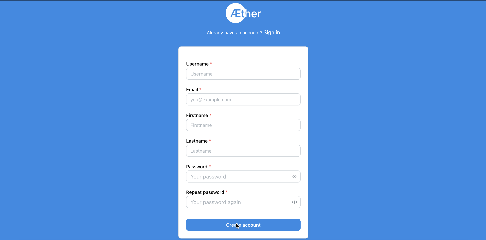
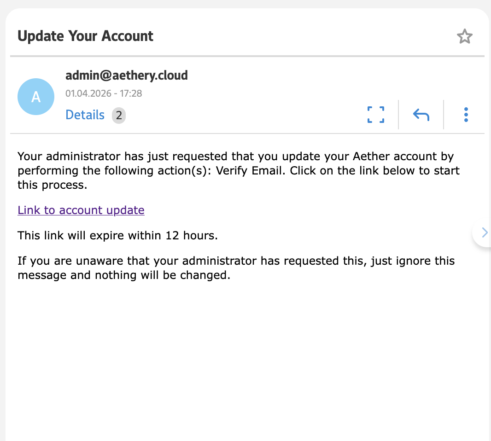
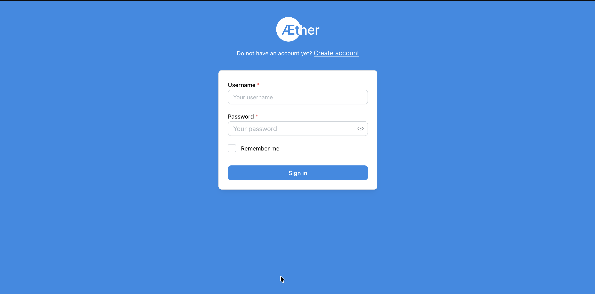
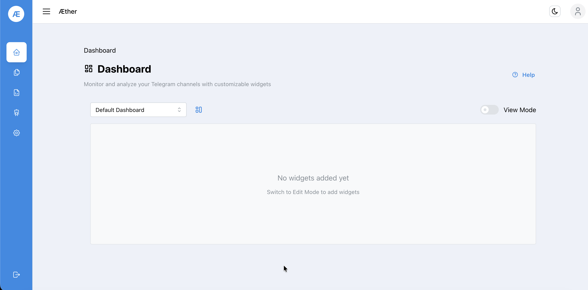

# Step 1 — Account Setup

## 1.1 Register

Navigate to [http://localhost](http://localhost) (or [https://athery.cloud](https://aethery.cloud)) and click **Create account**.

Fill in all required fields:

| Field | Notes |
|-------|-------|
| Username | Used for login |
| Email | Required for verification |
| Firstname / Lastname | Display name |
| Password | Min. 8 characters, repeat to confirm |

Click **Create account** to submit.

---

## 1.2 Verify Email

After registration, Æther sends a verification email from `admin@aethery.cloud`.

Click **Link to account update** to verify your address.

> ⚠️ The link expires after **12 hours**.

---

## 1.3 Log In

Return to the login page and sign in with your credentials.

After a successful login you are redirected to the **Dashboard**.

---

**Next:** [Step 2 — Telegram Session](02-telegram-session.md)
