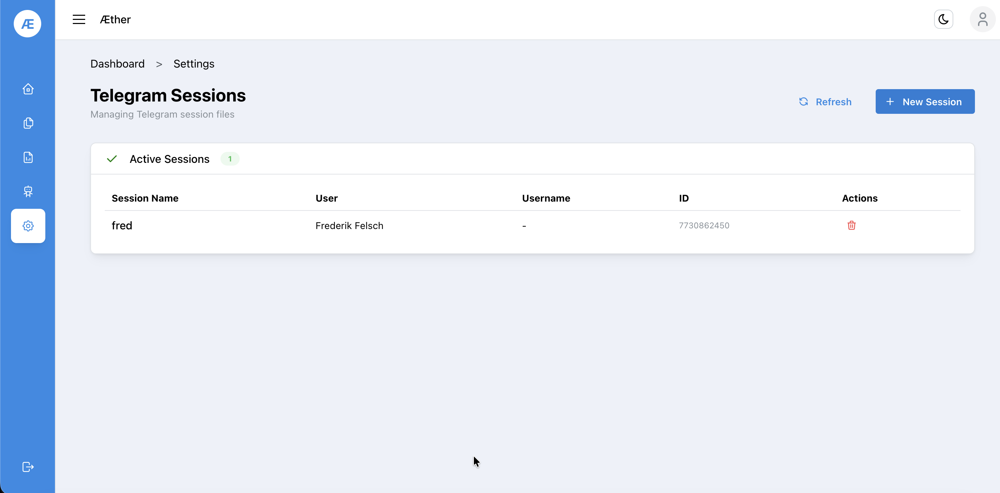

# Step 2 — Telegram Session

A Telegram session authorizes Æther to scrape channels on your behalf. You only need to do this once.

## 2.1 Open Settings

Click the **gear icon** (⚙️) in the left sidebar to open **Settings → Telegram Sessions**.

## 2.2 Create a New Session

Click **+ New Session** in the top right corner.

Enter:
- A **session name** (e.g. your first name)
- Your **Telegram phone number** (international format, e.g. `+49123456789`)

Telegram will send a **2FA code** to your Telegram app. Enter it when prompted.

## 2.3 Verify the Session

Once created, the session appears in the **Active Sessions** list with your user details and Telegram ID.

> ℹ️ You can delete a session at any time using the 🗑️ icon. Scrapers linked to a deleted session will stop working.

---

**Next:** [Step 3 — Cases](03-cases.md)
