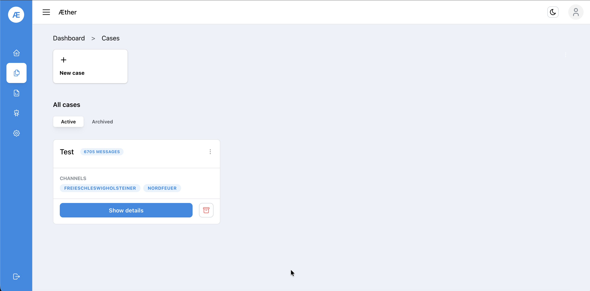
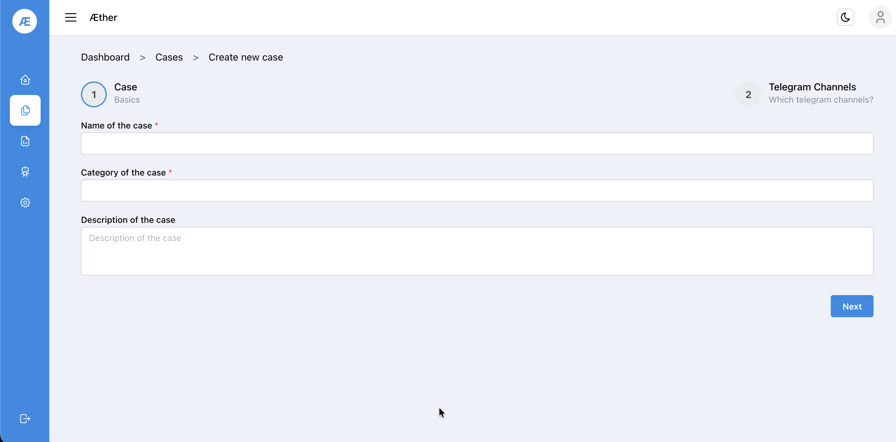
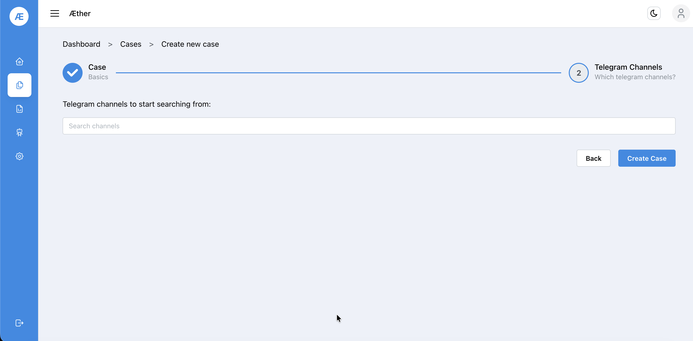

# Step 3 — Cases

A **Case** is a monitoring project that groups one or more Telegram channels together for analysis.

## 3.1 Cases Overview

Navigate to **Cases** via the sidebar (document icon 📄).

Existing cases show the channel count, message count, and a **Show details** button. Cases can be archived or deleted using the ⋮ menu.

## 3.2 Create a New Case

Click **+ New case**.

**Step 1 — Basics:**

| Field | Required | Notes |
|-------|----------|-------|
| Name of the case | ✅ | A descriptive label, e.g. `Election Monitoring DE` |
| Category | ✅ | Thematic grouping, e.g. `Politics` |
| Description | ❌ | Optional context for the case |

Click **Next**.

**Step 2 — Telegram Channels:**

Search for Telegram channel usernames (e.g. `nordfeuer`, `aktiv_berlin`) and add them to the case. You can add more channels later from the case detail view.

Click **Create Case**. Scrapers start automatically.

---

**Next:** [Step 4 — Analysis](04-analysis.md)
