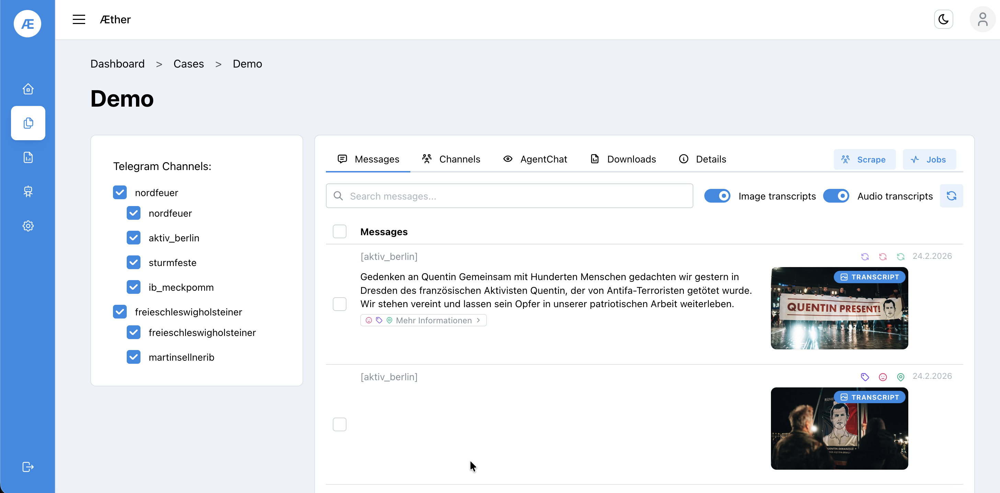
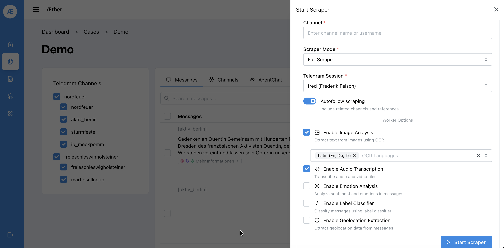
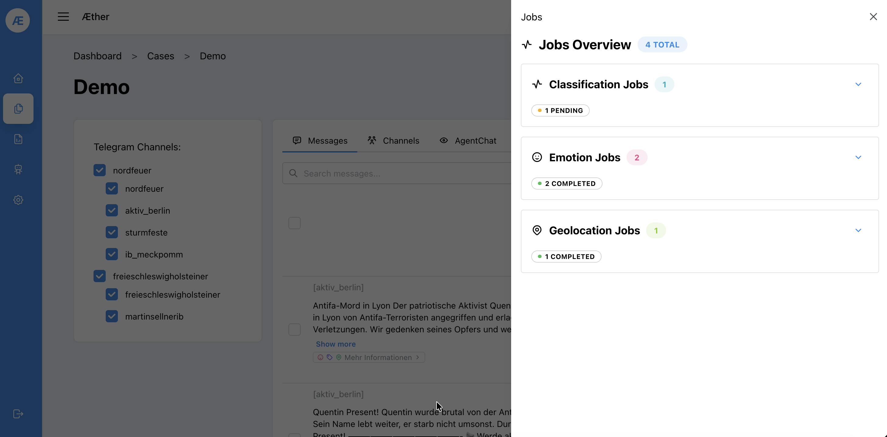
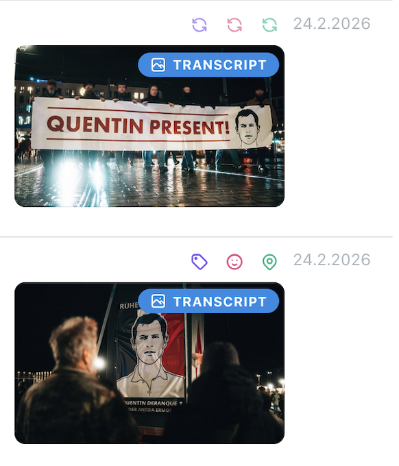

# Step 4 — Analysis

Open a case via **Cases → Show details** to access the full analysis view.

## 4.1 Messages Tab

The left panel lists all monitored channels with checkboxes to filter the view. The main panel shows collected messages with:

- **Full-text search** across all messages
- **Image transcripts** — OCR text extracted from images (toggle on/off)
- **Audio transcripts** — transcriptions of voice/video messages (toggle on/off)
- Metadata tags (geolocation 📍, emotion 😶, label 🏷️) per message

## 4.2 Starting a Scraper

Click **Scrape** (top right of the case view) to open the scraper configuration panel.

| Option | Description |
|--------|-------------|
| Channel | Target channel username or name |
| Scraper Mode | `Full Scrape` fetches all history; incremental modes fetch only new messages |
| Telegram Session | Select the session created in Step 2 |
| Autofollow scraping | Automatically follows referenced/linked channels |
| Enable Image Analysis | OCR text extraction from images |
| Enable Audio Transcription | Speech-to-text for audio/video |
| Enable Emotion Analysis | Sentiment and emotion classification per message |
| Enable Label Classifier | Automatic topic labeling |
| Enable Geolocation Extraction | Extracts location mentions from messages |

Click **▶ Start Scraper** to launch the job.

## 4.3 Monitoring Jobs

Click **Jobs** to see the status of all running and completed background jobs.

Job types include Classification, Emotion, and Geolocation jobs. Each shows a count and status badge (`PENDING`, `COMPLETED`).

---

## 4.4 Manually trigger Jobs

Analysis jobs can be triggered after the fact as well by clicking the emote-styled buttons in the top right of a message box.

If the Jobs have already been done they can be rerun by clicking the corresponding revolving-arrows.

**Next:** [Step 5 — Agent Chat](05-agent-chat.md)
