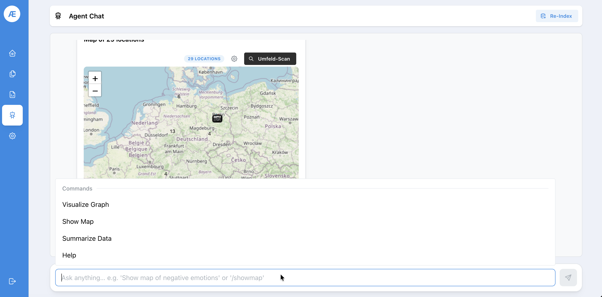
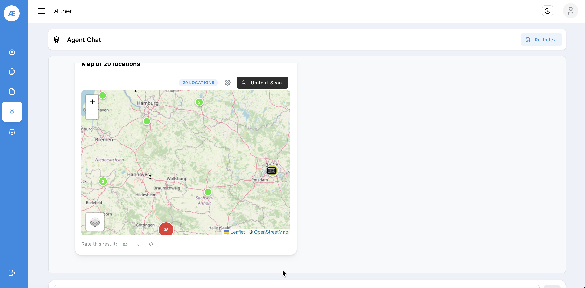
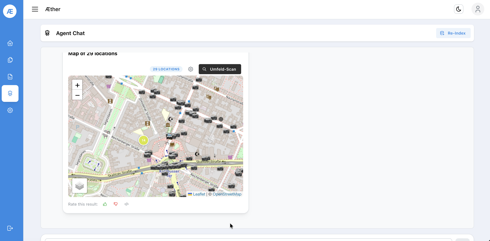
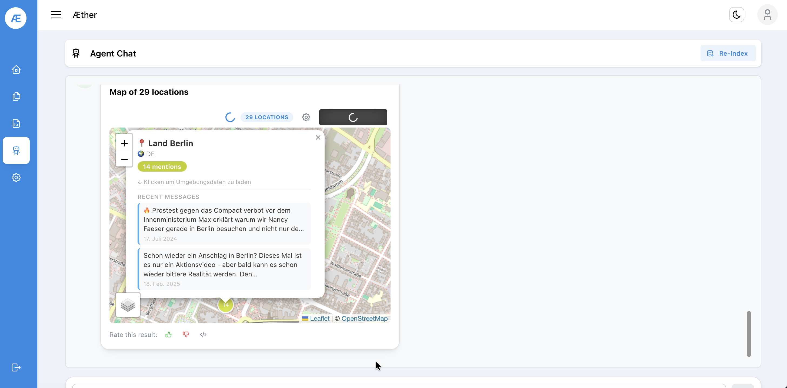
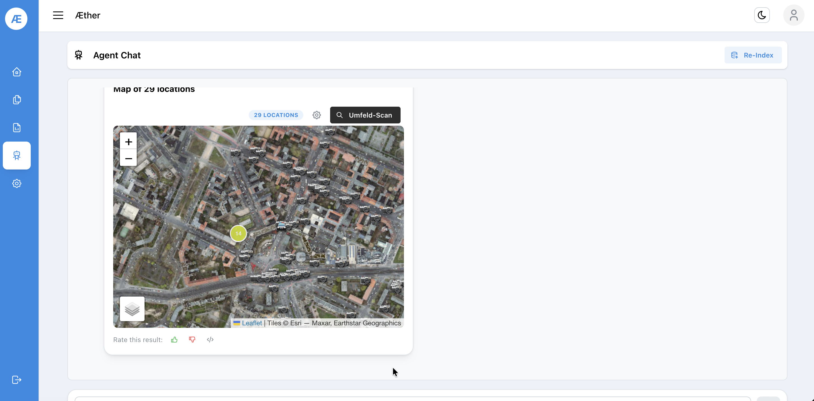
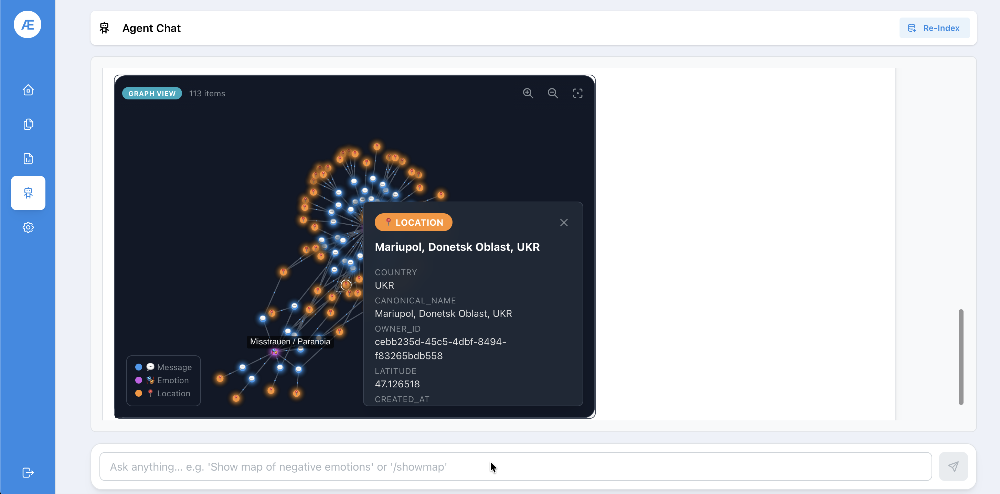

# Step 5 — Agent Chat

The **Agent Chat** is an AI-powered interface for querying and visualizing your case data using natural language or slash commands.

Access it via the **Agent Chat** tab inside a case, or via the robot icon (🤖) in the sidebar.

## 5.1 Available Commands

Type in the input field to see all available commands.

| Command | Description |
|---------|-------------|
| `/showmap` or `Show Map` | Render an interactive map of extracted locations |
| `Visualize Graph` | Show a Neo4j-based relationship graph of channels and entities |
| `Summarize Data` | Generate a natural language summary of the case data |
| `Help` | List all available commands |

You can also ask free-form questions, e.g. *"Show map of negative emotions"* or *"Which channels mentioned Berlin?"*.

## 5.2 Location Map

The agent renders geo-extracted locations on an interactive map.

**Overview map** — clustered markers across Germany:

**Zoomed cluster** — clicking a cluster zooms in and shows individual pins with mention counts:

**Location popup** — click any marker to see mention count and recent messages referencing that location:

**Satellite view** — toggle the map layer for satellite imagery with OSINT overlays:

> ℹ️ The **Umfeld-Scan** button triggers an area scan around the selected location, surfacing nearby OSINT data points.

## 5.3 Graph Visuals

The **Visualize Graph** command tries to return a Graph of nodes corresponding to you query. The model gets passed the main relationships in the Neo4j-Database to display multi-layered relations between e.g certain emotions and which locations are connected to them. 

## 5.4 Re-Index

Use the **Re-Index** button (top right of Agent Chat) to rebuild the search index after large scraping jobs.

---

**Next:** [Step 6 — Reports](06-reports.md)
