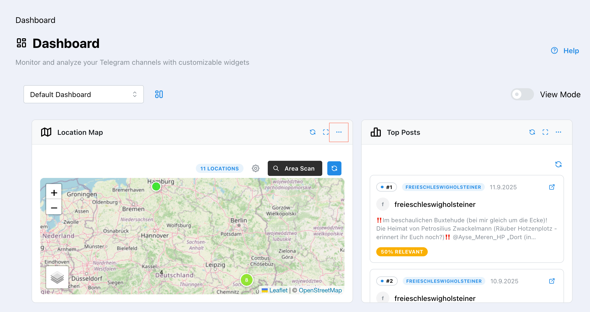
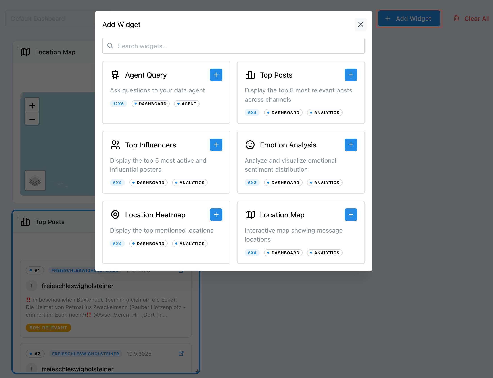
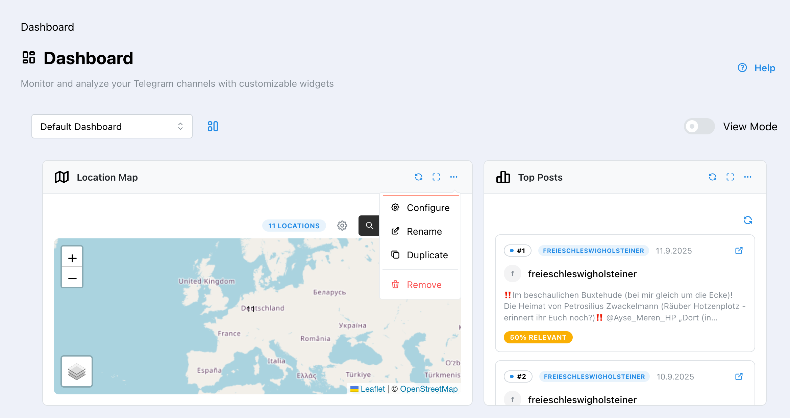
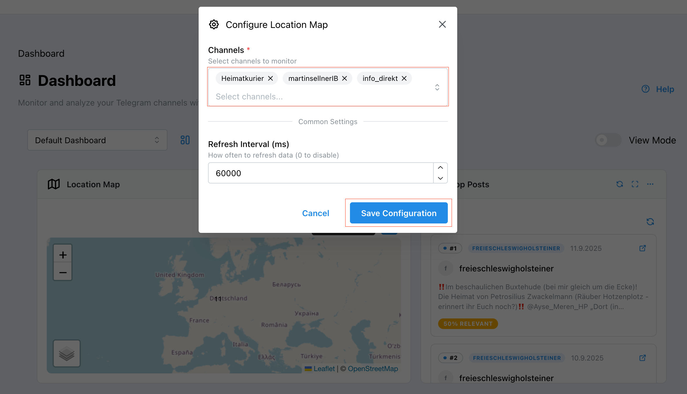
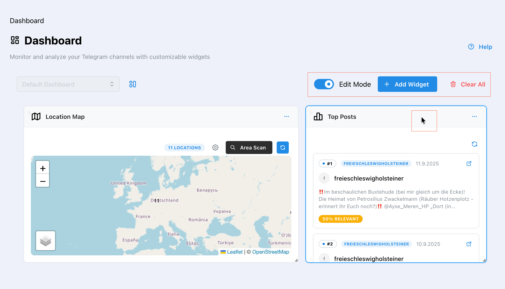
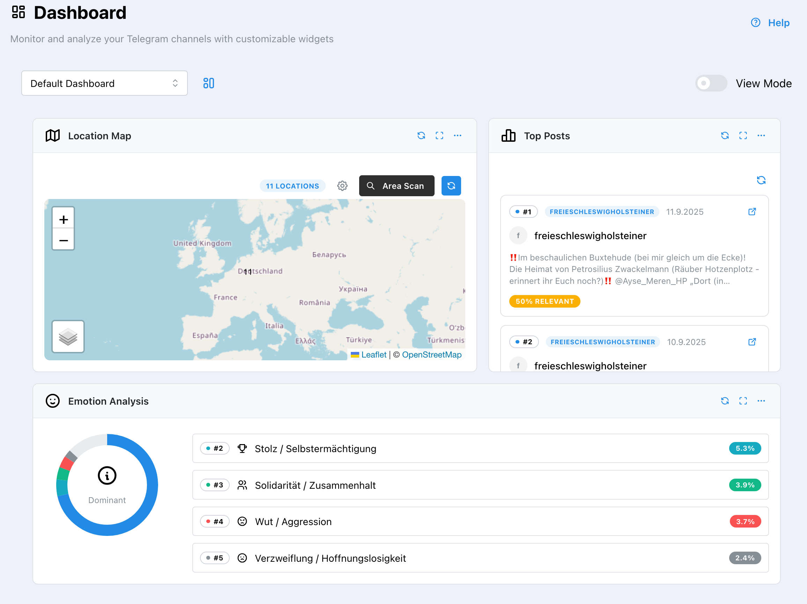

# Step 6 — Dashboard

The **Dashboard** is your main monitoring surface. It shows live data from your scraped channels through a set of customizable, resizable widgets that you arrange yourself.

Access it via the grid icon in the sidebar, or navigate to `/`.

---

## 6.1 Overview

The dashboard displays all your active widgets side by side. Each widget has a small toolbar in the top-right corner with **refresh**, **resize**, and a **menu** (⋯) button.

The **View Mode** toggle in the top-right switches between read-only view and edit mode.

---

## 6.2 Adding Widgets

Click **+ Add Widget** (top right, visible in Edit Mode) to open the widget picker.

The following widgets are available:

| Widget | Description |
|--------|-------------|
| **Agent Query** | Embed the AI agent chat directly in your dashboard |
| **Top Posts** | The 5 most relevant posts across selected channels |
| **Top Influencers** | The 5 most active and influential senders |
| **Emotion Analysis** | Donut chart of emotional sentiment distribution |
| **Location Heatmap** | Top mentioned locations ranked by count |
| **Location Map** | Interactive map of geo-tagged message locations |

Click **+** on any widget to add it to the dashboard.

---

## 6.3 Configuring a Widget

Every widget needs to know which channels to monitor. Open the widget menu via the **⋯** button and select **Configure**.

This opens the configuration panel:

| Setting | Description |
|---------|-------------|
| **Channels** | Select one or more scraped channels to use as the data source |
| **Refresh Interval (ms)** | How often the widget polls for new data — set to `0` to disable auto-refresh |

Click **Save Configuration** to apply. The widget will immediately reload with data from the selected channels.

---

## 6.4 Edit Mode — Drag, Resize & Arrange

Toggle **Edit Mode** to freely rearrange the dashboard layout.

In edit mode you can:

- **Drag** any widget to a new position
- **Resize** by pulling the bottom-right corner handle
- **Rename** or **Duplicate** a widget via the ⋯ menu
- **Remove** a widget via the ⋯ menu → Remove

Turn off Edit Mode when done — the layout is saved automatically.

---

## 6.5 Rearranged Layout

After adding and configuring multiple widgets, your dashboard might look like this:

Widgets update independently on their own refresh cycle. The **Location Map** shows clustered geo-pins, **Top Posts** shows ranked messages with relevance scores, and **Emotion Analysis** shows the dominant emotion distribution as a donut chart.

---

**Next:** [Step 7 — Reports](07-reports.md)
