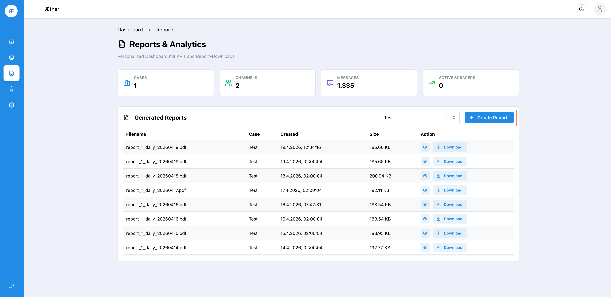
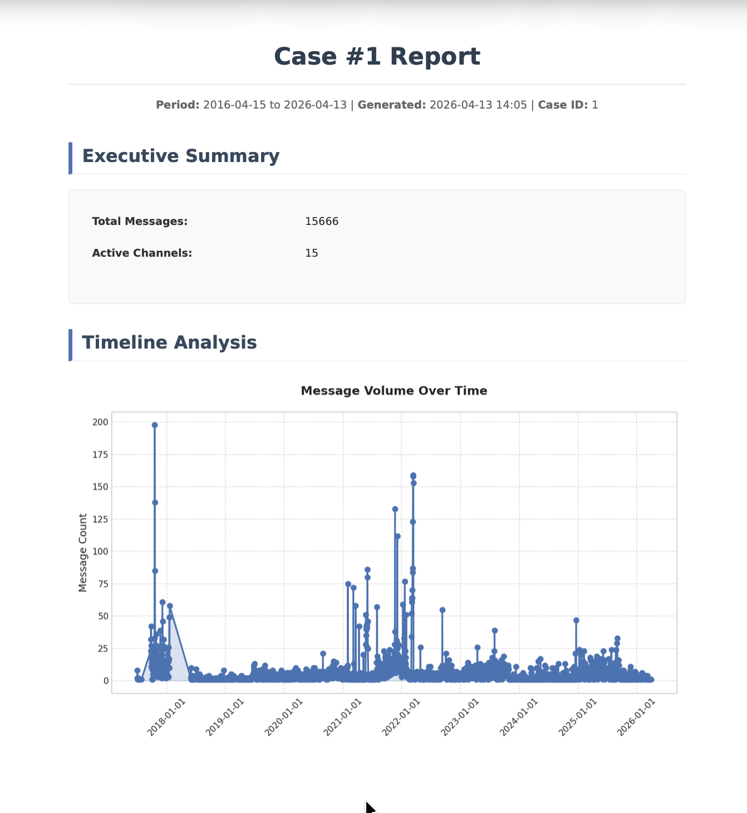

# Step 7 — Reports

Æther generates structured PDF reports for each case, summarizing collected messages, active channels, and timeline analysis.

## 7.1 Reports List

Navigate to **Reports** via the sidebar (📊 icon).

The table shows all generated reports with filename, associated case, creation timestamp, and file size. Reports are named by pattern: `report_<case_id>_<schedule>_<date>.pdf`.

| Column | Description |
|--------|-------------|
| Filename | Auto-generated, includes case ID and date |
| Case | The case this report belongs to |
| Created | Timestamp of generation |
| Size | File size in KB |
| Action | Preview (👁️) or Download |

Use **Filter by case** to narrow the list to a specific case.

## 7.2 Create a Report

Click **+ Create Report** to generate a new report on demand for any case.

## 7.3 Report Content

Each report contains:

- **Executive Summary** — total message count, active channels
- **Timeline Analysis** — message volume over time chart
- Additional sections depending on enabled analysis features (emotions, geolocation, labels)

> ℹ️ Daily reports are generated automatically at `02:00` each night for all active cases.

---

**You're all set!** Return to the [Tutorial Overview](README.md) or check the [main README](../README.md) for deployment and API details.